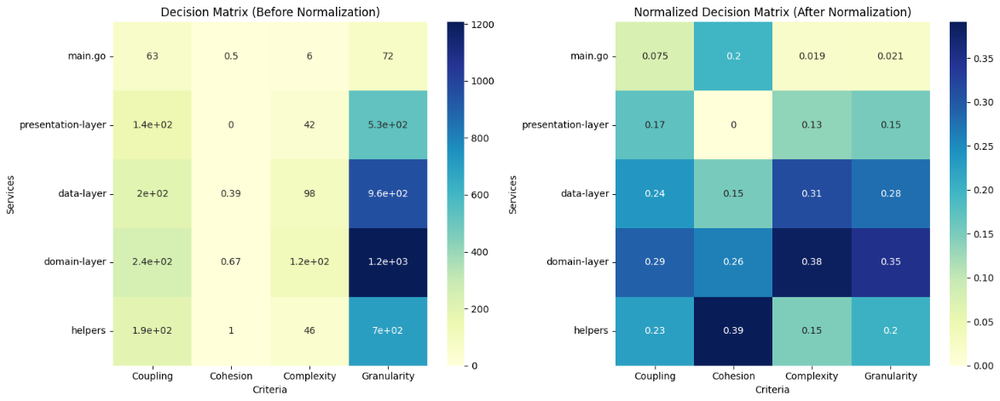

### RSBP-B-Kel20
Tugas RSBP Kelas B Kelompok 20
1. Arya Kreshna - 05111840000113
2. Mu’aafii Putra R. - 50525221135
3. M. Alif Satriadhi - 5025221188 

# EXTRACTION AND EVALUATION OF MICROSERVICE USING MCDM METHODE

### Abstract
Microservice architecture offers numerous advantages over traditional monolithic architecture, such as improved scalability, resilience, and development speed. However, migrating from monolithic to microservice applications presents significant challenges, particularly in extracting and evaluating microservice candidates. This research proposes an integrated framework for microservice extraction and evaluation using a Multi-Criteria Decision Making (MCDM) approach. The framework combines algorithms to automate the identification of microservice candidates from a monolithic application with an MCDM-based evaluation model to determine the best candidates based on criteria such as performance, scalability, reliability, and maintainability. The chosen MCDM method allows for weighting criteria based on business priorities and ranking microservice candidates based on aggregate scores. The framework is evaluated through a simulated monolithic application migration case study. The results show that the proposed framework can facilitate the microservice extraction and evaluation process more effectively and objectively. This research contributes to a practical framework that can assist practitioners in modernizing applications and adopting microservice architecture more efficiently. The framework also provides guidance in determining relevant criteria and selecting the appropriate MCDM method for evaluating microservice candidates.

## Background
In recent years, the rapid growth of complex software architectures—particularly those employing microservices—has increased the need for robust evaluation frameworks to guide decision-making. Identifying the most suitable multi-criteria decision-making (MCDM) methodology for assessing microservices is critical, as different methods may yield varying insights and outcomes. While numerous MCDM approaches have been proposed, there is a gap in the literature concerning a direct comparison of these techniques under a standardized set of metrics and conditions.

This research aims to address that gap by evaluating the relative effectiveness of several prominent MCDM methods—specifically, ELECTRE, VIKOR, AHP, and ENTROPY—within the context of microservice quality assessments. By first aggregating and normalizing relevant metrics that characterize each microservice’s structural and quality attributes, we then apply each MCDM technique to the same dataset. Through this direct comparison, our goal is to determine which method offers the most consistent, transparent, and actionable results for decision-makers seeking to optimize their microservice ecosystems.

## Related Work
Source code stands as the single most definitive and consistently available artifact for understanding an application's functionality. It provides a concrete representation of the implemented features, reflecting the current state of the application. In contrast, other artifacts, such as documentation, can become outdated or inaccurate over time, failing to capture the evolving nature of the software. Consequently, relying solely on these supplementary materials may lead to misinterpretations or incomplete understanding. Recognizing the primacy of source code as a reliable source of truth, numerous researchers have dedicated their efforts to developing approaches for microservice identification that leverage codebase analysis. This method allows for a more accurate and robust understanding of the application's structure and dependencies, ultimately facilitating the effective decomposition of a monolithic application into microservices.

[1] L. J. Kirby and co presented a microservice extraction technique that found out that practitioners find various relationship types useful for automated microservice extraction, no single strategy universally fits all applications. A key takeaway is the need for a flexible tool enabling "what-if" analysis to experiment with different relationships and weights based on application-specific, organizational, and domain-specific factors. For instance, structural relationships are influenced by programming language and can become less meaningful in older, larger monoliths. Semantic relationships can be unreliable due to language ambiguities, inconsistent naming conventions, and the reuse of terms across different contexts. Evolutionary relationships, particularly co-change data, are often prioritized as they reflect development patterns and capture evolving business requirements. However, data quality can be affected by factors like code age, team size, and the use of different code management systems. Participants also highlighted the potential value of incorporating database relationships and project management information into automated extraction techniques. Ultimately, effective microservice extraction requires careful consideration of these diverse factors and the ability to customize the analysis accordingly.

## Methodology and Study Design
In this section, we will brief about the methodology of the extraction and evaluation of the microservice and also which MCDM method we are using.

### Monolithic Application
We have been given a monolithic application source code  from our professor where we need to extract the microservice out of. 

### Microservice Extraction
The extraction phase addresses the challenge of identifying and structuring microservices from a potentially large and complex Go codebase. This is a critical prerequisite for enabling metric computation and subsequent evaluation. 

<b>A. Structural and Naming Conventions</b>
Microservices in Go projects often follow a layered structure, wherein each layer or directory correlates to a specific service domain, data processing function, or interface presentation. We leverage this architectural pattern by defining a set of known layer or service names—such as data-layer, domain-layer, and presentation-layer—that guide the classification process. The assumption here is that the project repository respects conventional naming practices, thus reducing ambiguity in service identification.

<b>B. Directory Traversal and File Classification</b>
A custom analyzer script traverses the project’s root directory recursively, using Python’s os.walk() function. For each .go source file encountered, the tool extracts the relative path and determines the service name from either the top-level directory or a key filename (e.g., main.go). Files are then grouped under their corresponding services. This approach is lightweight and does not rely on complex code parsing or dependency graph analyses; instead, it capitalizes on the project’s organizational practices.

<b>C. Data Structuring for Metrics Computation</b>
Once all files have been mapped to their respective services, the analyzer computes a series of metrics for each microservice, including coupling (imports and method references), cohesion (shared data and function usage), complexity (function count, cyclomatic complexity, line counts), and granularity (size and complexity scale). These metrics are aggregated at the service level and exported into a structured CSV file. The exported file serves as a standardized input to subsequent evaluation methods, ensuring consistency and reproducibility.

### Evaluation Criteria Definition

Following extraction, each identified microservice can be evaluated against predefined criteria. The evaluation phase employs MCDM methods to provide a more nuanced and balanced assessment than single-metric evaluations.

Criteria and Weight Assignments
Four key criteria are identified as relevant quality indicators for microservices: Coupling, Cohesion, Complexity, and Granularity. Each criterion reflects a distinct aspect of service quality. We assign a vector of weights to these criteria to express their relative importance. The chosen weights (e.g., [0.4, 0.3, 0.2, 0.1]) emphasize architectural modularity and maintainability.

### MCDM Based Evaluation

Evaluation of the microservice extracted is performed using Multiple Criteria Decision Making (MCDM). Our approach uses few MCDM methods such as ELECTRE, ENTROPY, and VIKOR. The steps performed are explained in these subsections.

#### <b>Data Collection</b>
The evaluation process begins with meticulous data collection. For each identified microservice candidate, data will be gathered for each of the defined evaluation criteria (Cohesion, Coupling, Complexity, Performance, Scalability, Maintainability, Reusability). Data collection methods will include: Static Analysis Metrics: Utilizing tools to automatically extract metrics related to code complexity, coupling, and cohesion. Examples include cyclomatic complexity, afferent and efferent coupling, and cohesion metrics like LCOM.

#### <b>Entropy Weight Determination</b>
The Entropy method will be employed to objectively determine the weights assigned to each evaluation criterion. This method calculates weights based on the information content of each criterion. Criteria with greater variability across the candidates will receive higher weights, indicating their greater significance in differentiating between options.

The process involves the following steps:

1. <b>Normalization</b>: Normalize the decision matrix to eliminate the influence of different measurement scales.

2. <b>Entropy Calculation</b>: Calculate the entropy of each criterion, reflecting its information content.

3. <b>Weight Calculation</b>: Determine the weight of each criterion based on its entropy value. Higher entropy implies lower weight, and vice versa.

[5]This analysis concludes that the determination of criteria weights in Multi-Criteria Decision Making (MCDM) significantly impacts the final ranking of alternatives, highlighting the crucial need for accurate weight estimation. The study finds that existing objective methods for weight evaluation lack sufficient theoretical justification, especially when using MCDM Entropy, raising questions about their rationality and necessitating further research into their underlying algorithms. While equal weighting offers a less subjective approach often favored in practice, differential weighting demands a carefully chosen methodology supported by strong theoretical foundations. MCDM Entropy the importance of comparing results from different weighting methods and acknowledges the lack of clear criteria for evaluating their effectiveness. Discrepancies in weighting results require thorough analysis, often leading to a preference for subjective expert opinions. Ultimately, the research advocates for developing a comprehensive Decision Support System (DSS) specifically designed for weight estimation. This proposed DSS would incorporate a wide range of methods, a knowledge base, and an intelligent system to analyze and synthesize results, effectively serving as an enhanced component within existing multi-criteria decision support systems.

#### <b>DELECTRE Method Application</b>

The ELECTRE (ELimination Et Choix Traduisant la REalité) method is used for outranking analysis. It compares pairs of microservice candidates to determine if one outranks the other based on concordance and discordance sets.

[4]This research proposes a novel approach, termed the HF-ELECTRE II method, to address multi-criteria decision-making (MCDM) problems involving uncertainties inherent in decision-makers' judgments. By extending the traditional ELECTRE II method to incorporate hesitant fuzzy sets (HFS), which allow for multiple possible values to represent uncertainty, the HF-ELECTRE II approach offers a more robust decision-making framework. The core of this new approach lies in defining hesitant fuzzy concordance and discordance sets based on score and deviation functions derived from HFS theory. However, the provided text is incomplete, cutting off before fully describing the derivation and application of these hesitant fuzzy concordance and discordance measures within the HF-ELECTRE II framework. A complete conclusion would require further information regarding how these measures are utilized to rank alternatives and ultimately solve MCDM problems.

[2]From the research done by Kannan Gocindan and Martin Brandt Jensen, it is concluded that a comprehensive review of 686 journal articles on ELECTRE and related concepts reveals a predominance of applied papers (544 out of 686) across 13 main application areas. This analysis, categorized by country of origin, publication journal, year, and specific ELECTRE version used, provides a valuable overview of the state-of-the-art research on ELECTRE in the field of MCDA. However, the review acknowledges limitations in its scope, excluding conference proceedings, books, non-English literature, and potentially some hybrid approaches or papers focusing solely on outranking concepts without explicit mention of ELECTRE. Despite these limitations, the authors believe the review offers a substantial contribution to understanding the breadth and depth of ELECTRE research and its practical applications.

#### <b>VIKOR Method Application</b>

The VIKOR (VIse Kriterijumska Optimizacija I Kompromisno Resenje) method is used to rank the remaining microservice candidates based on their compromise solution.

[8]The VIKOR method, designed for multi-criteria optimization of complex systems, identifies a compromise ranking list and determines a compromise solution along with weight stability intervals that ensure the chosen solution’s stability given the initial weighting. Its primary goal is to rank and select alternatives when dealing with conflicting criteria. To achieve this, it employs a multi-criteria ranking index that is derived from a specific measure of “closeness.”

#### <b>AHP Method Application</b>

[7]AHP is a widely used method for making complex decisions by organizing the problem into a hierarchy. This hierarchy breaks down the problem into smaller parts, creating levels and sublevels as needed. Experts then compare elements within each level, judging their relative importance using a scale of 1 to 9. These comparisons form matrices, which are used to calculate the overall importance of each element in the decision. However, getting reliable comparisons from experts can be a challenge in AHP. As per Saaty’s definition [6], a PCM is said to be consistent if all the elements of a matrix hold. 
ij = ik * kj

## Implementation

In this section, we will brief about what our team does to achieve the proposed target of  comparing MCDM evaluation methods. Given below is the flowchart used as the execution flow of the program.

### Develoopment Environment and Tools
The implementation was carried out in Python 3.10 using several standard data analysis libraries. Key dependencies included pandas (for CSV I/O and tabular data manipulation), numpy (for numerical computations), and Python’s built-in os and re modules (for file system traversal and pattern matching). Each MCDM method was implemented as a standalone class, allowing flexible experimentation with different weighting schemes and decision rules.

### Microservice Extraction and Metrics Aggregation
Before applying MCDM techniques, we first identified the microservices and computed their associated metrics using a custom GoMicroserviceAnalyzer module (not fully shown here, but described in Section III). This module traverses a specified Go project directory, identifies .go source files, and classifies them into predefined layers or services (e.g., data-layer, domain-layer, presentation-layer). It then computes several metrics for each microservice, including:

- Coupling: A measure derived from inter-file dependencies and imports.
- Cohesion: Computed by analyzing shared data and functions within a microservice.
- Complexity: Estimated using function counts, line counts, and cyclomatic complexity indicators.
- Granularity: Reflecting the size and scope of the microservice in terms of lines of code and complexity.

### Data Input for MCDM
All MCDM methods described below rely on the aggregated CSV file generated in the previous step. Upon loading the CSV (using pd.read_csv()), the metrics are read into a DataFrame. The first column contains the service names, while the subsequent columns represent the criteria to be considered. For consistency, each method uses the same set of criteria and the same weights for those criteria, unless stated otherwise.

### ELECTRE Implementation
The ElectreAnalyzer class (used in the code implementation) implements the ELECTRE method. Its workflow is as follows:
1. Normalization: The criteria values are normalized using vector normalization.
2. Weighting: Predefined weights (e.g., [0.4, 0.3, 0.2, 0.1]) are applied to each normalized criterion.
3. Concordance & Discordance Matrices: The algorithm computes a concordance matrix (how strongly one service outperforms another across all criteria) and a discordance matrix (to capture inconsistencies in comparisons).
4. Aggregate Dominance: Thresholds (e.g., 70th percentile for concordance and 30th percentile for discordance) determine when one service “dominates” another.
5. Ranking: The aggregate dominance matrix is used to compute dominance scores for each service. Sorting these scores results in a final ranked list of microservices.

### Entropy Based Analysis
The MCDMEntropy class uses a simpler approach, referred to as a fixed weights analysis with an entropy-normalization style. While the provided code snippet focuses primarily on fixed weights rather than full entropy weighting:

1. Normalization: Criteria are normalized column-wise so that each criterion’s values sum to one.
2. Weighting: Fixed weights are multiplied by the normalized values.
3. Scoring & Ranking: A score for each service is computed as a weighted sum of normalized criteria. The services are then ranked according to these scores.

Though the code given references the MCDMEntropy class in name, it primarily illustrates fixed-weight scoring rather than a full entropy-based weighting calculation. The foundational approach, however, can be extended with entropy weighting if desired

### VIKOR Implementation
The MCDMVikor class applies the VIKOR technique:

1. Normalization: Criteria values are normalized using min-max normalization to place all metrics on a [0,1] scale.
2. Weighted S and R Values: S (the utility measure) and R (the regret measure) are computed using the weighted, normalized criteria.
3. Q Calculation: The compromise solution Q is derived from S and R with a user-defined parameter v (default 0.5), balancing the weight between utility and regret.
4. Ranking: Services are sorted by their Q values. Lower Q indicates a more desirable service.

#### AHP Evaluation
The MCDMAHP class adopts a simplified Analytical Hierarchy Process (AHP) style evaluation where the criteria weights are predefined. Its implementation:
1. Normalization: Criteria columns are normalized using vector normalization.
2. Weighted Scoring: The normalized values are multiplied by fixed weights, and a composite score is produced for each service.
3. Ranking: Services are ranked in descending order of their final scores.]

### Parameter Configuration
Across all MCDM methods, we maintain a consistent set of weights to facilitate direct comparisons. For instance, the chosen weights [0.4, 0.3, 0.2, 0.1] assign decreasing importance to coupling, cohesion, complexity, and granularity respectively. Adjusting these weights allows the framework to emphasize different quality attributes of the microservices.

Threshold values used within ELECTRE are based on standard practice and can be tuned if domain experts suggest different breakpoints.

## Results and Discussions
In this section, we present and interpret the results obtained from applying the metric evaluation framework to three distinct microservice sets. Each set corresponds to a different microservice-based system, and the metrics—Coupling, Cohesion, Complexity, and Granularity—help us understand their structural and quality attributes.

### Overview of the evaluated system
First System:

This system comprised a small set of layers/services identified as main.go, presentation-layer, data-layer, domain-layer, and helpers. The analyzer reported the following aggregated metrics:
- main.go: Coupling (63), Cohesion (0.5), Complexity (6), Granularity (72)
presentation-layer: Coupling (144), Cohesion (0.0), Complexity (42), Granularity (526)
- data-layer: Coupling (198), Cohesion (0.390), Complexity (98), Granularity (959)
- domain-layer: Coupling (243), Cohesion (0.6667), Complexity (120), Granularity (1207)
- helpers: Coupling (189), Cohesion (1.0), Complexity (46), Granularity (699)

Second System:

A larger and more complex set of services, including favourite-service, discovery-service, inventory-service, api-gateway, order-service, product-service, promotion-service, notification-service, payment-service, search-service, proxy-client, rating-service, shipping-service, tax-service, and user-service. For example:
- favourite-service: Coupling (609), Cohesion (-0.190476), Complexity (63), Granularity (804)
- discovery-service: Coupling (24), Cohesion (1.0), Complexity (2), Granularity (37)
- user-service: Coupling (1476), Cohesion (0.042857), Complexity (274), Granularity (2565)

Third System:

A medium-sized system containing eureka-server, order-service, api-gateway, product-catalog-service, product-recommendation-service, and user-service. Sample metrics:
- eureka-server: Coupling (84), Cohesion (1.0), Complexity (21), Granularity (149)
- order-service: Coupling (597), Cohesion (0.587333), Complexity (146), Granularity (1166)
- api-gateway: Coupling (171), Cohesion (0.971429), Complexity (31), Granularity (258)

### Interppretin the metrics
<b>Coupling:</b>

Coupling values vary widely across services and systems. Higher coupling (e.g., user-service in the second system with 1476) suggests that the service relies on a large number of external components or has many interdependencies. Such services may be harder to modify in isolation and could require more coordination during maintenance. Conversely, services like discovery-service (24) or eureka-server (84) show relatively low coupling, hinting at simpler integration points and easier adaptability.

<b>Cohesion:</b>

Cohesion scores reflect the internal consistency of a service. Scores close to 1.0 (e.g., helpers in the first system, discovery-service and api-gateway in the second and third systems) suggest that a service’s internal logic and data usage are well-focused. Negative or extremely low cohesion values (e.g., favourite-service at -0.190476) may indicate that the service’s responsibilities are scattered or that it could benefit from refactoring to improve internal alignment of functionality.

<b>Complexity:</b>

The complexity metric (including factors like function counts and cyclomatic complexity) provides insight into how intricate each service’s logic is. More complex services, such as user-service in the second system (Complexity: 274) or order-service in the third system (Complexity: 146), may be more error-prone and require more careful testing. Lower complexity services, like discovery-service (Complexity: 2) or api-gateway (Complexity: 31 in the third system), are comparatively simpler, likely easier to maintain, and quicker to evolve.

<b>Granularity:</b>

Granularity, which correlates with size and functional scope, also varies significantly. Services with very large granularity values (e.g., user-service at 2565 in the second system) may represent “god services” that take on too many responsibilities. More balanced granularity (e.g., eureka-server at 149 or api-gateway at 258 in the third system) suggests a more manageable scope that aligns better with microservice principles.

### MCDM ELECTRE Evaluation
First System (5 Services):

The concordance matrix for the first system reveals that:
- Domain-layer and Helpers frequently achieve perfect or near-perfect concordance values (dark blue cells) when compared to others. This aligns with their high placement in the final ranking.
- Presentation-layer and main.go, on the other hand, show lighter cells against most competitors, indicating weaker dominance patterns.
- The discordance matrix for the same system shows that main.go and presentation-layer often have higher discordance values, reinforcing their lower rankings. Meanwhile, domain-layer and helpers maintain lower discordance scores, supporting their dominance.

Second System (15 Services):

The larger matrix for the second system demonstrates more complexity:
- Highly ranked services like proxy-client, user-service, and promotion-service exhibit many cells with higher concordance values (0.7 or above) when measured against a broad set of competitors.
- Services that rank poorly, such as api-gateway, generally fail to achieve high concordance values, reflecting weaker performance relative to others on the key criteria.
- The matrix’s intricate pattern of 0.3, 0.5, and 0.7 values shows a competitive environment where multiple services perform well on overlapping criteria, leading to closer rankings and ties at the top.

Third System (6 Services):          

For the third system:
- Order-service and user-service achieve consistently higher concordance scores compared to others, mirroring their top standings in the final ranking.
- Lower-ranked services, such as eureka-server, display many zero or low concordance values. This lack of strong pairwise dominance explains why these services did not accumulate high dominance scores.

By overlaying the final dominance-based rankings with these pairwise comparison matrices, we see how the ELECTRE method’s internal logic unfolds:
- Consistency with Rankings:
The services that appear at the top of the final rankings—like domain-layer in the first system, proxy-client in the second, and order-service in the third—tend to display high concordance values against multiple other services. This consistent outperformance across several criteria leads to higher dominance scores.
- Identifying Weak Links:
Services at the bottom of the rankings often fail to achieve high concordance values and may even appear as outliers with consistently lower or zero dominance patterns. Their position in the final ranking is less surprising when the pairwise performance is visualized.
- Refining Insights into Criteria Impact:
The presence of intermediate concordance values (0.3, 0.5, or 0.7) demonstrates how partial dominance is captured. A service does not need to dominate on every criterion to achieve a decent concordance score—performing well on the most heavily weighted criteria is often enough to tip the balance. This helps explain why even services not at the very top can still challenge others in the ranking, resulting in close contests and ties.

### MCDM Entropy Evaluation
The entropy-based (or fixed-weight) approach normalizes the raw decision matrix and then applies a predefined set of weights to produce a final score for each microservice. The same weighting vector is used as before—Coupling (0.4), Cohesion (0.3), Complexity (0.2), and Granularity (0.1)—to maintain compatibility with previous methods. Before normalization, the raw metrics vary widely across microservices. After normalization, all criteria are scaled to ensure a fair comparison, removing the bias introduced by differing magnitude ranges.

First System (5 Services)
- Initial Ranking: Domain-layer > helpers > data-layer > presentation-layer > main.go
- Interpretation:
Prior to normalization, metrics for domain-layer and helpers were relatively strong in terms of cohesion and balanced complexity, leading to higher weighted sums. After normalization, these strengths become more apparent since domain-layer maintains high relative values across the most heavily weighted criteria (coupling and cohesion), and helpers excels particularly in cohesion. Conversely, main.go and presentation-layer, which either lacked cohesion or had less favorable complexity and granularity values, suffer in the final weighted score.

Second System (15 Services)
- Initial Ranking (Entropy-Based): Tax-service > discovery-service > api-gateway > rating-service > user-service > ... > favourite-service
- Interpretation:
In this more complex environment, the entropy-based scoring generates a distinct hierarchy compared to ELECTRE. For instance, tax-service emerges as the top-ranked service due to strong performance in the most influential criteria. Discovery-service, which may have had high cohesion and relatively good complexity, also scores well here. Interestingly, user-service—highly ranked in ELECTRE evaluations—appears mid-level in this entropy-based ranking. This difference arises because entropy-based scoring does not consider pairwise dominance; it simply rewards services that perform well in absolute terms relative to the entire dataset’s distribution.
The normalization step is crucial: it ensures that services with extremely high raw values in coupling or complexity do not unfairly dominate. Instead, a service that achieves a well-rounded performance in the weighted criteria can surpass one that excels only in a single dimension.

Third System (6 Services)
- Initial Ranking (Entropy-Based): Order-service > user-service > product-recommendation-service > product-catalog-service > api-gateway > eureka-server
- Interpretation:
Here, order-service achieves the highest weighted score, similar to the ELECTRE-based outcome. This suggests that order-service’s strengths—such as a balanced combination of low coupling (or at least manageable), good cohesion, and reasonable complexity—are robust indicators of quality under both comparative (ELECTRE) and absolute (entropy-based) measurement frameworks.
The normalization plots show that order-service maintains relatively high normalized values in the most weighted criteria. User-service also appears strong, indicating good balance. Lower-ranked services, such as eureka-server, have less favorable normalized scores, making it challenging for them to climb the ranking.

### MCDM VIKOR Evaluation

The VIKOR method provides three key metrics for each service:

- S (Utility Measure): Reflects the aggregated distance from the ideal solution across all criteria.
- R (Regret Measure): Focuses on the worst-performing criterion to identify the maximum regret.
- Q (Compromise Solution): Combines S and R, with a parameter v (often set to 0.5) balancing the importance of collective utility (S) against individual dissatisfaction (R). Lower Q values indicate a solution closer to the ideal compromise.

The visual heatmaps aid in understanding these values at a glance: lighter cells represent better scores (closer to zero), while darker cells represent worse performance.

First System (5 Services)
- Ranking: main.go (Q=0.0000) > presentation-layer (Q=0.1488) > data-layer (Q=0.6377) > helpers (Q=0.6703) > domain-layer (Q=1.0000)
- Interpretation:
main.go, unexpectedly, emerges as the top solution according to VIKOR, with the lowest Q value. This suggests that, relative to other services, main.go has a balanced or less extreme deviation from the ideal solution.
The domain-layer, which often scored well in other methods like ELECTRE, appears last in VIKOR analysis. This may be because domain-layer has at least one criterion that performs significantly worse relative to others, driving its R (Regret) value higher and thus increasing Q.
The heatmap shows that main.go’s S and R are small compared to others, meaning it is not far from the best criteria values collectively or in its worst criterion. Domain-layer’s dark-blue cells for S and R indicate it is relatively far from the ideal.

Second System (Multiple Services, 15)
- Top Rankings: shipping-service (Q=0.0178), favourite-service (Q=0.0204), notification-service (Q=0.0610)
Lower Rankings: tax-service, user-service, and proxy-client receive higher Q values (further from the ideal).
- Interpretation:
The shipping-service, which may not have been the top contender in other methods, comes out first here. A low S and R score means it’s consistently close to the ideal solution across multiple criteria, and does not have a single extremely poor criterion.
Services like user-service and proxy-client have higher Q values, indicating that at least one of their criteria is significantly worse relative to the best performer, raising their Regret (R) and overall Q scores.
The heatmap for this system clearly shows a gradient of performance, with top-ranked services having lighter cells (lower S, R, Q) and bottom-ranked services having darker cells, signifying larger divergences from the ideal reference point.

Third System (6 Services)
- Ranking: product-catalog-service (Q=0.1456) > eureka-server (Q=0.1857) > api-gateway (Q=0.2169) > user-service (Q=0.2515) > product-recommendation-service (Q=0.2887) > order-service (Q=1.0000)
- Interpretation:
Here, product-catalog-service emerges as the best compromise solution according to VIKOR, followed closely by eureka-server. These services likely maintain a good balance across criteria without a single glaring weakness.
At the opposite end, order-service shows a Q value of 1.0000, indicating it has the least favorable compromise solution. High S and/or R values suggest that order-service is far from ideal in either collective performance or in at least one key criterion.
The heatmap reveals that product-catalog-service and eureka-server’s performance is moderately good across criteria (lighter tones), while order-service’s darker cells, especially in the S (Utility) dimension, confirm its substantial deviation from ideal conditions.

### MCDM AHP Evaluation

Below is an interpretation and discussion of the AHP-based results for the three microservice sets, in a style consistent with previous method analyses. The Analytical Hierarchy Process (AHP)-inspired approach here uses a fixed set of weights and normalizes the decision matrix to derive a single composite score for each microservice.

First System (5 Services)
- Ranking: domain-layer > helpers > data-layer > presentation-layer > main.go
- Interpretation:
Here, the AHP results align closely with intuitive expectations. Domain-layer tops the list due to robust performance in critical criteria—its normalized scores in Cohesion, Complexity, and Granularity are comparatively high. Helpers also does well, aided by a strong cohesion score. Meanwhile, main.go trails behind, partly because it is a simple entry point and not a fully developed service unit, lacking strong performance in heavily weighted criteria like cohesion.

The normalization reveals how differences in scale are managed. Services with very large line counts or complexity measures do not automatically dominate; instead, their relative performance in each criterion, weighted by importance, shapes the final outcomes.

Second System (More Complex Set)
- Top-Ranked Services (AHP): proxy-client, user-service, tax-service, rating-service, promotion-service
- Lower-Ranked Services: shipping-service, notification-service, payment-service, favourite-service
- Interpretation:
In a larger, more complex set, the AHP method identifies proxy-client and user-service as top performers, indicating that these services maintain favorable relative positions across the weighted criteria. For instance, if proxy-client’s coupling is high but justified by strong cohesion and moderate complexity, the weighted sum can still push it ahead. The normalized matrix shows that even large numerical differences in raw metrics become more comparable post-normalization.
Services like favourite-service end up at the bottom. If it has unfavorable scores in the most heavily weighted criteria (e.g., high coupling, low cohesion), the normalization and weighting will reflect that, producing a lower composite score.

Third System (6 Services)
- Ranking: order-service > user-service > product-recommendation-service > product-catalog-service > api-gateway > eureka-server
- Interpretation:
Order-service emerges as the top contender, possibly due to a balanced profile: it may have relatively better scores in the weighted criteria than its peers. User-service and product-recommendation-service also rank well, suggesting a generally favorable performance across criteria once normalized. At the bottom, eureka-server may serve a more infrastructural role and not score as highly on the same criteria, leading to a lower weighted sum.

### Comparison

Below is a comprehensive comparison of the four MCDM methods—ELECTRE, Entropy-based (Fixed Weights), VIKOR, and AHP—applied to three different sets of microservices. Each method has produced its own ranking based on the same underlying criteria (Coupling, Cohesion, Complexity, Granularity) and weights, but the results highlight how differing decision rules and evaluation philosophies can yield distinct outcomes.

#### Different Method

- ELECTRE:
Relies on pairwise comparisons to determine concordance (agreement on criteria) and discordance (disagreements). It produces a dominance-based ranking, revealing not just who scores best overall but which services outperform which others in a head-to-head fashion. Thresholds define when one service is said to dominate another.

- Entropy-Based (Fixed Weights):
Directly normalizes criteria and applies fixed weights to produce a single score per service. This method ranks services purely on their aggregated, weighted performance. It does not consider pairwise competition, instead focusing on each service’s absolute standing relative to the entire set.

- VIKOR:
Introduces the idea of a compromise solution, balancing collective satisfaction (S) against the worst criterion (R) to produce Q, a measure of how close a service is to an ideal compromise. VIKOR can produce different results if a service is consistently “good enough” or if it fails on one critical criterion.

- AHP (Fixed Weights):
Uses a simple, transparent weighting scheme on normalized criteria. Like the entropy-based method, AHP offers a direct weighted aggregation, but it often resonates with intuitive expectations—services scoring well on the most important criteria rise to the top. AHP does not incorporate pairwise dominance or compromise measures like ELECTRE or VIKOR.

#### Different System

First System (5 Services):

- ELECTRE: Identified the domain-layer and helpers as top performers. Main.go was at the bottom.
- Entropy: Produced a similar hierarchy, with the domain-layer on top and helpers, data-layer following closely.
- VIKOR: Surprised by ranking main.go at the top. This occurred because main.go did not have a single highly deficient criterion relative to the ideal solution, balancing out its overall S and R measures. The domain-layer dropped to the bottom under VIKOR’s logic.
- AHP: Aligned well with expectations similar to ELECTRE and entropy, placing domain-layer first and main.go last.

Summary for First System:
ELECTRE, Entropy, and AHP largely agree on the top performers (domain-layer) and laggards (main.go), while VIKOR offers a contrasting perspective, demonstrating its sensitivity to how compromise solutions are evaluated.

Second System (Multiple Services):

- ELECTRE: Produced a complex dominance pattern, sometimes leading to ties or near-ties at the top. Services like proxy-client and user-service often stood out.
- Entropy: Highlighted services that consistently performed well across criteria, bringing unexpected candidates like tax-service to the forefront. Some previously top-ranked services by ELECTRE appeared more mid-level.
- VIKOR: Rewarded services that had no severe weaknesses, making shipping-service top-ranked. Services strong in one criterion but weak in another dropped lower.
- AHP: Created a clear numeric hierarchy, often aligning with the notion of balanced performance. Proxy-client and user-service again rose high, but other services shuffled based on how they responded to fixed weights and normalization.

Summary for Second System:
No single service dominated across all methods. ELECTRE’s pairwise logic, entropy’s absolute scoring, VIKOR’s compromise-oriented approach, and AHP’s straightforward weighted sum produced overlapping yet distinct rankings. This indicates a complex ecosystem where different evaluation philosophies spotlight different “best” services.

Third System (6 Services):

- ELECTRE: Identified order-service and user-service as strong contenders.
- Entropy: Also tended to favor services that balanced multiple criteria well, though it could highlight different leaders if one service excelled in the most weighted criteria.
- VIKOR: Choose product-catalog-service as the top compromise solution, while pushing order-service (highly ranked by ELECTRE) to the bottom due to its higher R (regret) values.
- AHP: Placed order-service at the top, aligning more with ELECTRE’s intuition that it performed best in heavily weighted criteria, while services like eureka-server also remained lower.

Summary for Third System:
The third system again shows that VIKOR can drastically differ if a service underperforms in one critical area. AHP and ELECTRE often found order-service best, while VIKOR’s methodology penalized it severely. Entropy-based rankings landed somewhere in between, depending on how each service’s normalized scores compared.

## Summary
The four MCDM methods offer complementary perspectives on microservice quality. While methods like ELECTRE and AHP often confirm intuitive top performers, VIKOR and Entropy-based evaluations can challenge assumptions and highlight different aspects of performance. Ultimately, employing multiple MCDM methods provides a richer, more nuanced picture of the microservice ecosystem, aiding informed decision-making about where to invest improvement efforts and how to design future architectural changes.